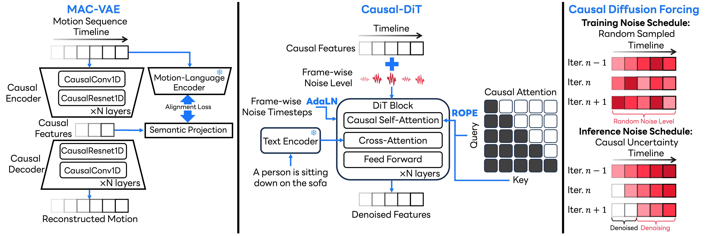

# Causal Motion Diffusion Models (CMDM)

This repository contains materials developed by LY Corporation and is temporarily open-sourced for the purpose of [our reseach project](https://arxiv.org/abs/2602.22594).
 
- **Temporary Release**: This repository is temporarily available as open-source. Therefore this repository may be turn into read-only or private anytime.
- **Attribution**: All code and materials in this repository are owned by LY Corporation.

## Project Overview

Code of the paper "Causal Motion Diffusion Models for Autoregressive Motion Generation" (CVPR 2026).
<div align="center">


[](https://arxiv.org/abs/2602.22594)
[](https://yu1ut.com/CMDM-HP/)
[](http://creativecommons.org/publicdomain/zero/1.0/)
</div>

##  ⚙️ Getting Started
<details>
<summary><b>Installation, pre-trained models, and data</b></summary>

### 1. Python Environment using uv
```bash
uv sync
```

### 2. Models and Dependencies

#### Download Evaluation Models
1. Download **glove** to `glove` folder and **t2m_evaluators** to `checkpoints` folder from [MARDM](https://github.com/neu-vi/MARDM) repository for robust 67-dim evaluation. 

2. Download **t2m_evaluators** from [TM2T](https://github.com/EricGuo5513/TM2T) repository to `checkpoints` and rename its `text_mot_match` folder to `text_mot_match_full` for 259-dim evaluation.

#### Download Pre-trained Models
Download pre-trained models from [huggingface](https://huggingface.co/ly-corporation/CMDM) and put them in `checkpoints/t2m/`.

### 3. Obtain Data
Download **HumanML3D** Dataset from the repository of [HumanML3D](https://github.com/EricGuo5513/HumanML3D). Unzip and locate it in the `datasets` folder.

The whole directory should be look like this:
```
CMDM
│   README.md
│   pyproject.toml
|   ...
|
└───glove
└───train
└───...
│   
└───datasets
|    └───HumanML3D
|       └───new_joint_vecs
|       └───...
│   
└───checkpoints
     └───t2m
          └───pretrained_tmr
          └───pretrained_vae
          └───pretrained_dit
          └───text_not_match
          └───text_not_match_clip
          └───text_not_match_full
```
</details>

## 🎬 Demo

<details>
<summary><b>Demo scripts</b></summary>

### Text-to-motion generation (default)
```bash
uv run python -m sample.demo \
  prompt_csv=sample/sample_prompt.csv \
  exp=my_demo \
  autoregressive=false \
  num_samples=5
```

When `autoregressive=false` and `prompt_csv` is provided, the script generates `num_samples` results for each `(prompt, length)` row in the CSV.

Outputs are saved in `generations/<exp>/` as:
- `sample_XX_repXX.mp4`
- `sample_XX_repXX.npy`

Here, the first `XX` is the prompt-length pair index, and the second `XX` is
the repetition index.

### Autoregressive long-horizon generation
```bash
uv run python -m sample.demo \
  prompt_csv=sample/sample_prompt.csv \
  exp=my_demo_ar \
  autoregressive=true \
  num_samples=5
```

When `autoregressive=true` and `prompt_csv` is provided, each CSV row is used as the next segment in one long sequence, generated in order with causal conditioning from prior segments. `num_samples` controls how many full long sequences are sampled.

Outputs are saved in `generations/<exp>/` as:
- `long_sample_repXX.mp4`
- `long_sample_repXX.npy`

</details>

## 📊 Evaluate Pre-trained CMDM models

<details>
<summary><b>Evaluate pre-trained models</b></summary>

### Evaluate MAC-VAE
```bash
uv run python -m eval.eval_ae name=pretrained_vae
```
### Evaluate Causal-DiT
Robust evaluation Without redundant features. 
```bash
uv run python -m eval.eval_ae_dit name=pretrained_dit ae_name=pretrained_vae feature_dim=67
```
Use feature_dim=259 for general 259-dimensional evaluation.

</details>

## 📖 Train CMDM

<details>
<summary><b>Train CMDM models</b></summary>

Train/eval entrypoints are Hydra-based. Default configs are in `conf/`, and CLI overrides use `key=value` (for example, `gpu=0 name=MAC_VAE`).

### Train Part-TMR
```bash
uv run python -m Part_TMR.scripts.train
```

### Train MAC-VAE
```bash
uv run python -m train.train_ae name=MAC_VAE
```

### Train Causal-DiT
```bash
uv run python -m train.train_ae_dit name=Causal_DiT
```

</details>

## 🎆 Evaluate CMDM models

<details>
<summary><b>Evaluate CMDM models</b></summary>

### Evaluate MAC-VAE
```bash
uv run python -m eval.eval_ae name=MAC_VAE
```
### Evaluate Causal-DiT
```bash
uv run python -m eval.eval_ae_dit name=Causal_DiT
```

</details>

## Acknowledgement

Some parts of our code are based on [ACMDM](https://github.com/neu-vi/ACMDM) and other third-party software listed in [NOTICE.txt](NOTICE.txt).

## Citation

```bibtex
@inproceedings{yu2026causal,
      title={Causal Motion Diffusion Models for Autoregressive Motion Generation},
      author={Yu, Qing and Watanabe, Akihisa and Fujiwara, Kent},
      booktitle={CVPR},
      year={2026}
  }
```

## Contributions
 
As this project is temporarily open-sourced, we are not accepting contributions. For feedback or inquiries, please open an issue in this repository.

## License
 
This code is dedicated to the public domain under [CC0 1.0](https://creativecommons.org/publicdomain/zero/1.0/). 
You may copy, modify, and distribute it without restriction, and the authors make no warranties or guarantees regarding its use.

Additionally, this repository contains third-party software. Refer [NOTICE.txt](NOTICE.txt) for more details and follow the terms and conditions of their use.
